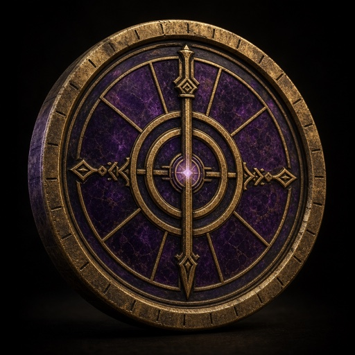
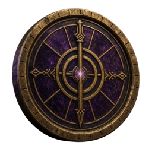

# Hegemony Mark Currency Reference

**Presentation preview**

**Transparent preview**

> **A Mark — the Hegemony’s main in-game currency.**

## Coordinate

- Archive release tag: `hegemony-mark-2026-07-13`
- Archive date: 2026-07-13
- Presentation attachment: `hegemony-mark-main-currency.png`
- Transparent attachment: `hegemony-mark-main-currency-transparent.png`

## Role

These images are archived visual references for a **Mark**, the Hegemony’s main in-game currency.

Both byte-exact source PNGs are immutable GitHub Release attachments. The smaller JPEG and transparent PNG committed to Git are discoverability previews only. Warpkeep runtime clients must not use release attachments as CDN dependencies.

## Source and authority

Ael supplied both images and explicitly authorized this public deposit in Warpkeep-Assets. Private communication and attachment metadata are intentionally omitted.

The 1024×1024 presentation PNG contains a 29,087-byte `caBX` Content Credentials block. Its readable assertions identify `OpenAI Media Service API`, `gpt-image` version `2.0`, and IPTC `trainedAlgorithmicMedia`, with an asserted creation time of `2026-07-13T00:00:00Z`. The signature was not independently verified. No readable generation prompt or private workflow identifier was observed in the embedded block.

The 500×500 transparent PNG has no text metadata or embedded Content Credentials block.

Both named source PNGs and both Git-tracked previews are licensed under **CC BY 4.0**, effective for Warpkeep v0.3.0 and later, with attribution to the Warpkeep project. See [`LICENSES/CC-BY-4.0.txt`](../LICENSES/CC-BY-4.0.txt).

Suggested credit:

> “Warpkeep Hegemony Mark currency artwork” by the Warpkeep project, licensed under CC BY 4.0.

The grant applies only to copyright and related rights controlled by the Warpkeep project. It does not license OpenAI services, names, trademarks, third-party rights, or Warpkeep trademarks and canonical identity.

## Visual and technical record

Both square images present a circular coin or medallion with an aged gold-brass rim and geometric relief over a deep purple stone-like face. Concentric rings, radial divisions, and cardinal spear-like motifs converge on a small purple central glow. No readable text or third-party logo is visible.

### Presentation attachment

- Background: black presentation field with grounding shadow
- Dimensions: 1024×1024
- Color: 8-bit RGB, no alpha, non-interlaced
- Bytes: 1,847,255
- SHA-256: `1065cf06409af4bc18274ffb0a98f9fc71c908dac28382e6a4eae60f98354953`

### Transparent attachment

- Background: transparent; the Mark remains fully framed and unclipped
- Dimensions: 500×500
- Color: 8-bit RGBA, non-interlaced
- Alpha: 102,633 fully transparent, 3,333 partially transparent, and 144,034 fully opaque pixels
- Bytes: 407,560
- SHA-256: `059a61fb40d9e04fdaf27327a921ed5a3174ec48c1549512a71fbbb71aeb2b86`
