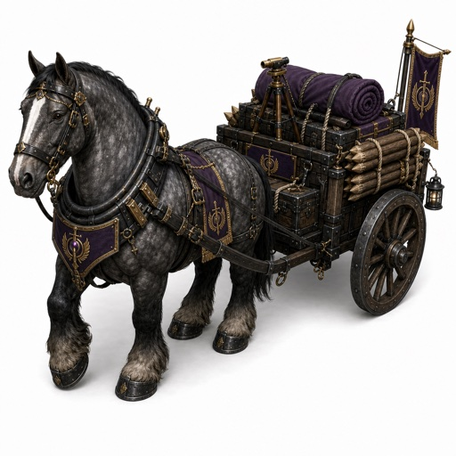

# Hegemony Supply Wagon Visual Reference

## Coordinate

- Archive release tag: `hegemony-supply-wagon-2026-07-14`
- Archive date: 2026-07-14
- Source attachment: `hegemony-supply-wagon.png`
- Label status: descriptive archive label; no stricter canonical game name asserted

## Role

This image is archived as a visual reference for a Hegemony-themed horse-drawn field supply wagon. The byte-exact source PNG is an immutable GitHub Release attachment. The smaller JPEG committed to Git is a discoverability preview only. Warpkeep runtime clients must not use the release attachment as a CDN dependency.

## Source and authority

Ael supplied the image and explicitly authorized this public deposit in Warpkeep-Assets. Private communication-platform and attachment identifiers are intentionally omitted from public metadata.

The source PNG contains a 24,918-byte `caBX` Content Credentials block. Its readable assertions identify `OpenAI Media Service API`, `gpt-image` version `2.0`, and IPTC `trainedAlgorithmicMedia`, with an asserted creation time of `2026-07-14T00:00:00Z`. The signature was not independently verified. No readable generation prompt was observed. Three standard structural C2PA UUIDs are embedded in the byte-exact source; their values are not repeated in public metadata.

Ael authorized publication and distribution of the named source PNG, preview, and archive metadata as part of this public repository and release. No separate open-license grant is asserted. This deposit does not license OpenAI services, names, trademarks, third-party rights, Warpkeep trademarks and canonical identity, or other Warpkeep material.

## Visual record

A heavy dapple-gray draft horse in ornate black metal and leather harness pulls a rugged two-wheeled wooden field wagon. The wagon carries dark crates, purple bedrolls, a brass telescope, bundled wooden stakes, a lantern, and a purple-and-gold banner. Repeating purple-and-gold heraldic motifs visually associate the reference with the Hegemony. The subject is fully framed on a clean white presentation background with a soft ground shadow. No readable text, third-party logo, person, or personal identifier is visible.

## Technical record

### Source attachment

- Dimensions: 1024×1024
- Color: 8-bit RGB, no alpha, non-interlaced
- Background: white presentation field with ground shadow
- Bytes: 1,537,793
- SHA-256: `1fb83e10c477acaf5c5f63aaba3df5b2891eb4dded34f94155e718824d8c925f`

### Git preview

- Dimensions: 512×512
- Color: 8-bit RGB JPEG
- Composition: full source framing preserved without cropping or distortion
- Bytes: 89,418
- SHA-256: `3f800270b1058aac71198e1916b6b2e711ec7fc2d4b158b7e73b66f192458709`
